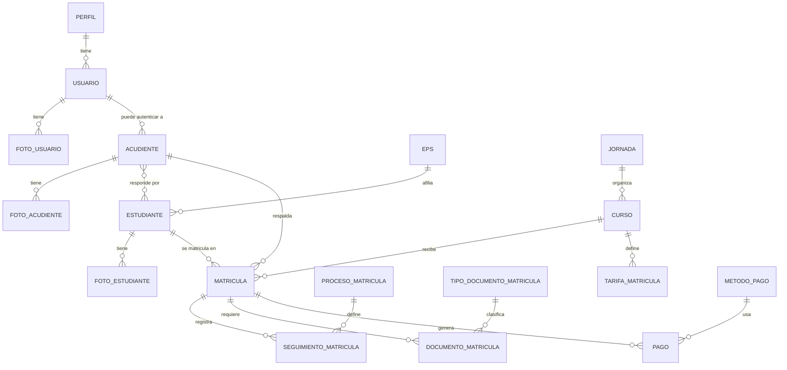

# GestMat · API Backend

API REST construida con **Django** y **Django REST Framework** para la gestión integral de matrículas de una institución educativa: usuarios y perfiles, estudiantes y acudientes, cursos y jornadas, el proceso de matrícula con seguimiento por pasos, documentos de matrícula, pagos/tarifas, certificados en PDF y un dashboard de reportes.

El frontend correspondiente (React + Vite) vive en un repositorio hermano, `Front-gestmat`, y consume esta API bajo el prefijo `/api/`.

## Tabla de contenido

- [Stack tecnológico](#stack-tecnológico)
- [Arquitectura y apps](#arquitectura-y-apps)
- [Modelo de datos](#modelo-de-datos)
- [Autenticación y permisos](#autenticación-y-permisos)
- [Documentación de la API](#documentación-de-la-api)
- [Funcionalidades destacadas](#funcionalidades-destacadas)
- [Panel de administración (Jazzmin)](#panel-de-administración-jazzmin)
- [Requisitos previos](#requisitos-previos)
- [Instalación y puesta en marcha](#instalación-y-puesta-en-marcha)
- [Variables de entorno](#variables-de-entorno)
- [Docker](#docker)
- [Datos de prueba y pruebas de carga](#datos-de-prueba-y-pruebas-de-carga)
- [Testing](#testing)
- [Estructura del proyecto](#estructura-del-proyecto)
- [Notas y problemas conocidos](#notas-y-problemas-conocidos)

## Stack tecnológico

| Componente | Versión | Uso |
|---|---|---|
| Django | 6.0.4 | Framework principal |
| Django REST Framework | 3.17.1 | API REST |
| djangorestframework-simplejwt | 5.5.1 | Autenticación JWT (access + refresh, blacklist) |
| django-cors-headers | 4.9.0 | CORS para el frontend |
| django-jazzmin | 3.0.4 | Tema visual del admin de Django |
| mssql-django / pyodbc | 1.7.2 / 5.3.0 | Driver hacia SQL Server (motor principal) |
| psycopg2-binary | 2.9.12 | Driver hacia PostgreSQL (motor alternativo) |
| pillow | 12.2.0 | Procesamiento de imágenes (fotos de usuarios/estudiantes/acudientes) |
| reportlab | 4.5.1 | Generación de certificados en PDF |
| python-decouple | 3.8 | Lectura de configuración desde `.env` |

> El proyecto se desarrolló con Python 3.14 localmente; el `Dockerfile` usa `python:3.12` como base. Se recomienda **Python 3.12+**.

## Arquitectura y apps

El backend está dividido en 4 apps de Django que juntas conforman un único esquema relacional:

- **`usuarios`** — autenticación (login/JWT, recuperación de contraseña), usuarios del sistema, perfiles (roles), tipos de documento, fotos de usuario y auditoría/trazabilidad. También expone los endpoints de dashboard, catálogos generales y certificados (`usuarios/certificados/`).
- **`academico`** — catálogo académico: estudiantes, acudientes, cursos, jornadas y EPS.
- **`matriculas`** — el núcleo del negocio: matrículas, el catálogo de pasos del proceso (`Proceso_matricula`), el seguimiento de cada matrícula por paso, los documentos requeridos por matrícula y la configuración del mes de ingreso.
- **`pagos`** — métodos de pago, tarifas por curso/año lectivo y el registro de pagos.

## Modelo de datos



**Entidades principales** (nombre de modelo → tabla):

| Modelo | Tabla | Campos / notas clave |
|---|---|---|
| `Usuario` | `SEC_Usuarios` | Extiende `AbstractUser`, PK `id_usuario`, FK a `Perfil` y `Tipo_documento`, campos de reseteo de contraseña, permisos personalizados por módulo |
| `Perfil` | `SEC_Perfiles` | Rol con 4 flags CRUD (`insert/update/delete/view_perfil`) |
| `Tipo_documento` | `tipos_documento` | Catálogo (CC, TI, etc.) |
| `Foto_Usuario` / `Foto_Acudiente` / `Foto_Estudiante` | `SEC_Fotos_Usuarios` / `ACA_Fotos_*` | Hasta 4 fotos por entidad |
| `Trazabilidad` | `AUD_Trazabilidad` | Auditoría: usuario, acción, descripción, IP, dispositivo |
| `Eps`, `Jornada` | `eps`, `jornadas` | Catálogos |
| `Curso` | `ACA_Cursos` | Cupo total/disponible, jornada, activo |
| `Acudiente` | `ACA_Acudientes` | Puede tener un `Usuario` asociado para autenticarse |
| `Estudiante` | `ACA_Estudiantes` | M2M con `Acudiente` (un estudiante puede tener varios responsables) |
| `Matricula` | `MAT_Matriculas` | Estudiante + acudiente + curso + jornada + año lectivo + estado |
| `Proceso_matricula` | `PRCM_Matricula` | Catálogo ordenado de pasos del flujo de matrícula |
| `Seguimiento_matricula` | `MAT_Seguimientos_Matricula` | Estado de cada paso por matrícula (`pendiente/en_proceso/completado/rechazado`) |
| `Documento_matricula` | `MAT_Documentos_Matricula` | Documento cargado, con usuario que carga y usuario que revisa |
| `Tipo_documento_matricula` | `tipos_documento_matricula` | Catálogo de documentos requeridos (marcados como obligatorios o no) |
| `ConfiguracionMesIngreso` | `MAT_Configuracion_Mes_Ingreso` | Fecha de inicio por defecto según el mes de matrícula |
| `Metodo_pago` | `metodos_pago` | Catálogo |
| `TarifaMatricula` | `PAG_Tarifas_Matricula` | Valor por curso + año lectivo |
| `Pago` | `PAG_Pagos` | Pago asociado a una matrícula y un método de pago |

## Autenticación y permisos

- **JWT** vía `djangorestframework-simplejwt`: access token de 30 minutos, refresh de 7 días, con rotación y blacklist automáticas. El login acepta **usuario o correo** indistintamente (backend de autenticación custom `usuarios.backends.EmailBackend`).
- El acceso a la API requiere autenticación por defecto (`IsAuthenticated`); las rutas de login, registro de usuario y recuperación de contraseña son públicas.
- El sistema combina **tres capas de permisos**:
  1. **`PermisoPorPerfil`** (`backend/permissions.py`): permiso grueso basado en los 4 flags booleanos del `Perfil` del usuario (ver/crear/editar/eliminar), aplicado de forma transversal en la mayoría de los ViewSets.
  2. **Permisos por módulo** declarados en `Usuario.Meta.permissions` (`ver_modulo_matriculas`, `ver_modulo_gestion_academica`, `ver_modulo_administracion`, `ver_dashboard_matriculas`) y los permisos estándar de Django por modelo (asignables por grupo desde el admin). Se exponen al frontend en el login como `usuario.permisos_modulos`, y son los que determinan qué rutas y menús ve cada usuario en la SPA.
  3. Verificaciones puntuales con `request.user.has_perm(...)` (por ejemplo, revisar/aprobar un documento de matrícula exige `matriculas.view_documento_matricula`) y comparaciones directas contra `perfil.nombre_perfil == 'Administrador'` en varias vistas para decidir si el usuario ve todos los registros o solo los propios (por ejemplo, un acudiente solo ve a sus propios estudiantes).
- **Recuperación de contraseña**: genera un token de un solo uso (`secrets.token_urlsafe`), lo envía por correo con un enlace al frontend, y lo valida junto con la fecha de solicitud antes de permitir definir una nueva contraseña.

## Documentación de la API

Todas las rutas cuelgan de `/api/` (salvo el admin en `/admin/`). Los recursos con router siguen el patrón estándar de DRF: `GET` (list/retrieve), `POST` (create), `PUT`/`PATCH` (update), `DELETE` (destroy).

### Autenticación (`/api/auth/`)

| Método | Endpoint | Descripción |
|---|---|---|
| POST | `auth/login/` | Login con usuario o email → `{access, refresh, usuario}` |
| POST | `auth/logout/` | Invalida (blacklist) el refresh token |
| POST | `auth/token/refresh/` | Renueva el access token |
| POST | `auth/password-reset/` | Solicita enlace de recuperación por correo |
| POST | `auth/password-reset-confirm/` | Confirma la nueva contraseña con el token recibido |

### Usuarios, perfiles y catálogos

| Método | Endpoint | Descripción |
|---|---|---|
| GET/POST | `usuarios/` | Listar / crear usuarios del sistema |
| GET/PUT/PATCH/DELETE | `usuarios/{id}/` | Detalle, edición y borrado (solo admin o el propio usuario) |
| GET/POST | `usuarios/{id}/fotos/` | Fotos del usuario (hasta 4) |
| DELETE | `usuarios/{id}/fotos/{foto_id}/` | Eliminar una foto |
| GET/POST/PUT/DELETE | `perfil/`, `perfil/{id}/` | CRUD de perfiles/roles |
| GET/POST/PUT/DELETE | `tipos-documento/`, `eps/`, `jornada/`, `metodo_pago/`, `tipo_doc_matricula/` (+ `/{id}/`) | Catálogos generales |
| GET | `fecha_ingreso_actual/` | Fecha de inicio configurada para el mes/año actual |

### Académico

| Método | Endpoint | Descripción |
|---|---|---|
| GET/POST/PUT/DELETE | `curso/`, `curso/{id}/` | CRUD de cursos |
| PUT | `curso/{id}/actualizar-cupo/` | Ajusta manualmente el cupo disponible |
| PUT | `curso/{id}/cambiar-estado/` | Activa/desactiva un curso |
| GET/POST/PUT/DELETE | `acudientes/`, `acudientes/{id}/` | CRUD de acudientes (un no-admin solo ve los propios) |
| GET/POST | `acudientes/{id}/fotos/` | Fotos del acudiente |
| GET/POST/PUT/DELETE | `estudiante/`, `estudiante/{id}/` | CRUD de estudiantes |
| POST | `estudiante/{id}/agregar-acudiente/` | Vincula (o crea) un acudiente a un estudiante existente |
| GET/POST | `estudiante/{id}/fotos/` | Fotos del estudiante |

### Matrícula, seguimiento y documentos

| Método | Endpoint | Descripción |
|---|---|---|
| GET/POST/PUT/DELETE | `matricula/`, `matricula/{id}/` | CRUD de matrículas (la creación arma acudiente + estudiante + matrícula en una sola transacción) |
| GET | `procesomatricula/?matricula_id=` | Catálogo de pasos con su estado calculado para una matrícula |
| GET/POST/PATCH | `seguimiento_matricula/` (`?matricula_id=`, `?paso_id=`) | Avance de una matrícula por paso (sin PUT/DELETE) |
| GET | `documento_matricula/?matricula_id=` | Documentos cargados para una matrícula |
| POST | `documento_matricula/` | Sube un documento (`multipart/form-data`) |
| DELETE | `documento_matricula/{id}/` | Elimina un documento (solo si sigue `Pendiente`) |
| GET | `documento_matricula/tipos_disponibles/?matricula_id=` | Cruza el catálogo de tipos requeridos con lo ya cargado |
| PUT | `documento_matricula/{id}/revisar/` | Aprueba/rechaza un documento (requiere permiso `matriculas.view_documento_matricula`) |

### Pagos, dashboard, trazabilidad y certificados

| Método | Endpoint | Descripción |
|---|---|---|
| GET/POST/PUT/DELETE | `pagos/`, `pagos/{id}/` | CRUD de pagos |
| GET | `dashboard/stats/` | KPIs: matrículas activas, ingresos, ocupación de cupos, tendencia mensual, documentos por estado, alertas de cupo bajo, últimas acciones de auditoría |
| GET | `dashboard/export/?tipo_reporte=matriculas\|pagos\|cupos` | Exporta un reporte en CSV (filtrable por año/curso/fechas) |
| GET | `trazabilidad/`, `trazabilidad/{id}/` | Log de auditoría (solo lectura) |
| GET | `certificados/matricula/{id}/certificado/` | Genera y descarga el certificado de matrícula en PDF |

## Funcionalidades destacadas

- **Proceso de matrícula guiado por pasos**: `Proceso_matricula` define un orden obligatorio; `Seguimiento_matricula` no permite avanzar a un paso si el anterior obligatorio no está completado. Documentado en detalle en [`DOCUMENTACION_SEGUIMIENTO_MATRICULA.md`](DOCUMENTACION_SEGUIMIENTO_MATRICULA.md).
- **Automatizaciones por señales** (`matriculas/signals.py`, `pagos/signals.py`): al crear una matrícula se completan automáticamente los pasos iniciales y se descuenta un cupo del curso (se devuelve si la matrícula se desactiva); al confirmarse un pago se marca automáticamente como completado el paso de "pago" en el seguimiento; si existe una `ConfiguracionMesIngreso` activa, se autocompleta la fecha de inicio de la matrícula.
- **Documentos de matrícula**: carga de archivos (PDF/JPG/PNG) con nombre único por timestamp, flujo de revisión (Pendiente → Aprobado/Rechazado) con usuario que carga y usuario que revisa por separado.
- **Certificados en PDF**: generados al vuelo con ReportLab (no se guardan en disco), con los datos de la matrícula, el estudiante y el acudiente.
- **Dashboard de reportes**: KPIs agregados con el ORM de Django (matrículas, ingresos, ocupación de cupos, tendencias) y exportación a CSV con codificación compatible con Excel en español.
- **Auditoría**: cada acción relevante (creación, edición, eliminación, carga de fotos) queda registrada en `Trazabilidad` con usuario, IP y dispositivo de origen.

## Panel de administración (Jazzmin)

El admin de Django (`/admin/`) usa **django-jazzmin** con branding propio ("GestMat"), búsqueda global sobre usuarios/estudiantes/matrículas, e iconos por modelo. Personalizaciones destacadas:

- `MatriculaAdmin` incluye una plantilla propia con filtro de fecha, una acción masiva para "Asignar fecha de ingreso" a varias matrículas, e inlines de solo lectura con el seguimiento y los documentos de cada matrícula.
- `UsuarioAdmin` muestra avatar con iniciales y badges de color según el perfil y el estado.
- `PagoAdmin` / `TarifaMatriculaAdmin` muestran badges de estado/valor y enlaces directos a la matrícula relacionada.
- Las apps `academico` (estudiantes, acudientes, cursos) se gestionan desde el frontend y deliberadamente no se registran en el admin.

## Requisitos previos

- Python 3.12+
- Una base de datos accesible: SQL Server (motor por defecto, requiere el **ODBC Driver 17 for SQL Server** instalado en el sistema) o PostgreSQL/SQLite como alternativa.
- (Opcional) Docker, si se prefiere no instalar Python localmente.

## Instalación y puesta en marcha

```bash
# 1. Crear y activar un entorno virtual
python -m venv venv
venv\Scripts\activate          # Windows
source venv/bin/activate       # Linux/Mac

# 2. Instalar dependencias
pip install -r requirements.txt

# 3. Crear un archivo .env en la raíz del backend (ver variables abajo)

# 4. Aplicar migraciones
python manage.py migrate

# 5. Crear un usuario administrador
python manage.py createsuperuser

# 6. (Opcional) Poblar datos de prueba
python manage.py generar_datos_prueba --cantidad 1000

# 7. Levantar el servidor de desarrollo
python manage.py runserver
```

La API queda disponible en `http://127.0.0.1:8000/api/` y el admin en `http://127.0.0.1:8000/admin/`. El frontend (Vite, puerto `5173`) ya está habilitado en CORS.

> El comando `generar_datos_prueba` depende de **Faker**, que no está listado en `requirements.txt`. Instálalo aparte con `pip install Faker` si vas a usarlo.

## Variables de entorno

El proyecto lee su configuración de base de datos con `python-decouple` desde un archivo `.env` en la raíz del backend:

| Variable | Descripción | Valor por defecto |
|---|---|---|
| `DB_ENGINE` | Motor de base de datos Django (`mssql`, `django.db.backends.postgresql`, `django.db.backends.sqlite3`, ...) | `mssql` |
| `DB_NAME` | Nombre de la base de datos | `gestmat` |
| `DB_USER` | Usuario de la base de datos | *(vacío)* |
| `DB_PASSWORD` | Contraseña de la base de datos | *(vacío)* |
| `DB_HOST` | Host del servidor | `localhost` |
| `DB_PORT` | Puerto (si se omite, no se envía) | *(vacío)* |
| `DB_DRIVER` | Driver ODBC (solo si `DB_ENGINE=mssql`) | `ODBC Driver 17 for SQL Server` |
| `DB_TRUSTED_CONNECTION` | Autenticación integrada de Windows (solo mssql) | `False` |

> `SECRET_KEY` y las credenciales SMTP para el envío de correos de recuperación de contraseña **aún viven hardcodeadas en `settings.py`**, no en el `.env`. Ver [Notas y problemas conocidos](#notas-y-problemas-conocidos).

## Docker

```bash
docker build -t gestmat-backend .
docker run -p 8000:8000 --env-file .env gestmat-backend
```

El `Dockerfile` instala dependencias y corre el servidor de desarrollo de Django (`runserver`), no un servidor de producción. No ejecuta `migrate` automáticamente ni incluye un servicio de base de datos: hay que aplicarlas manualmente (`docker exec <container> python manage.py migrate`) y apuntar `DB_HOST` a una base de datos accesible desde el contenedor.

## Datos de prueba y pruebas de carga

- `python manage.py generar_datos_prueba --cantidad N` crea perfiles, tipos de documento, EPS, jornadas y cursos base, y luego `N` estudiantes con acudiente y matrícula asociados (datos con `Faker` en locale `es_CO`).
- `locustfile.py` define una prueba de carga básica (`locust -f locustfile.py`) que hace login y golpea `GET /api/estudiante/` y `GET /api/matricula/` de forma autenticada. Requiere un usuario `locust_test` preexistente en la base de datos objetivo.
- `actualizar_fechas_matriculas.sql` es un script T-SQL de utilidad para redistribuir fechas de matrícula de forma realista en datos de demostración (pensado para que el dashboard de tendencias se vea representativo).

## Testing

```bash
python manage.py test
```

La suite actual (`usuarios/tests.py`) cubre casos básicos de autenticación y acceso a estudiantes (login, acceso no autenticado rechazado, listado autenticado, creación). No cubre todavía matrículas, pagos, documentos ni seguimiento en profundidad.

## Estructura del proyecto

```
backend/
├── backend/            # settings, urls raíz, wsgi/asgi
├── usuarios/           # auth, usuarios, perfiles, auditoría, certificados, dashboard, catálogos
│   ├── certificados/   # generación de PDF
│   ├── management/     # comando generar_datos_prueba
│   ├── templates/admin/# plantillas custom del admin (filtro de fecha, asignación masiva)
│   ├── urls/            # un archivo de rutas por recurso
│   └── views/
├── academico/          # estudiantes, acudientes, cursos, jornadas, EPS
├── matriculas/         # matrícula, proceso y seguimiento, documentos
├── pagos/              # métodos de pago, tarifas, pagos
├── static/css/         # CSS custom del admin
├── media/              # archivos subidos (fotos, documentos) — no versionado
├── Dockerfile
├── requirements.txt
├── locustfile.py
└── manage.py
```

## Notas y problemas conocidos

**Seguridad — pendiente antes de producción:**
- `SECRET_KEY` y las credenciales SMTP (`EMAIL_HOST_USER`/`EMAIL_HOST_PASSWORD`) están escritas en texto plano en `settings.py` en lugar de leerse desde `.env` como ya se hace con la base de datos. Se recomienda rotarlas y migrarlas a variables de entorno.
- `DEBUG = True` y `ALLOWED_HOSTS = []` son configuración de desarrollo; deben ajustarse antes de desplegar.
- `CORS_ALLOW_ALL_ORIGINS = True` permite cualquier origen (existe además una variable `CORS_ALLOWD_ORIGINS` con un typo que Django/cors-headers ignora silenciosamente).

**Deuda técnica / limpieza pendiente:**
- `MEDIA_ROOT` apunta a una ruta absoluta de Windows (`C:/fotos_matriculas/`) en vez de una carpeta relativa al proyecto o configurable por entorno.
- `usuarios/views/pago_views.py` y `usuarios/urls/pago_urls.py` son una implementación anterior de Pagos (previa a la extracción de la app `pagos`) que ya no está conectada a ningún router; puede eliminarse.
- El router de `acudientes` está registrado dos veces (`acudiente_urls.py` y `trazabilidad_urls.py`).
- `Faker` se usa en `generar_datos_prueba.py` pero falta declararlo en `requirements.txt`.
- La cobertura de tests es limitada (ver [Testing](#testing)).
